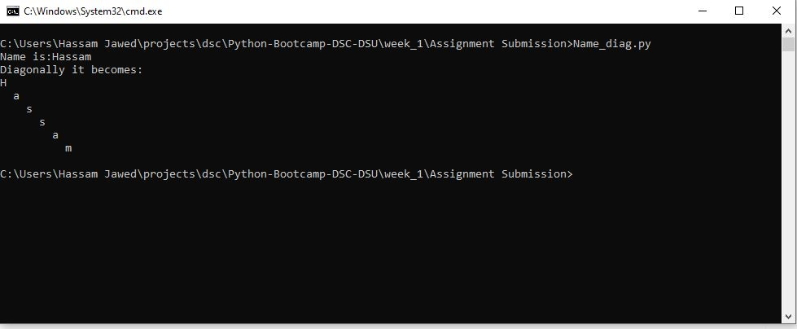

# DSC-DSU | Python Bootcamp 2020 | Week 1
All programs are in folder Assignment Submission.
## 1: Program to print the name taken from user input diagonally
The Name_diag.py is program which takes string input from user then print the name diagonally. Also there is also program named Name_revdiag1.py which do the same task but prints from right not from left as in Name_diag.py

## 2: Program to take 5 students records and then prints the name of highest & lowest scorer
The grade_storage.py is program which takes roll number,name,age,marks of any given number of students ,print them,and tells who is the highest scorer,lowest scorer and average marks amongest the records.
## 3: Program which prints song lyrics with 1 second delay after each line.
The song.py is program which prints song lyrics with 1 second delay after each line. The song choice was open so the song which i used was "Video Killed Radio Star"

