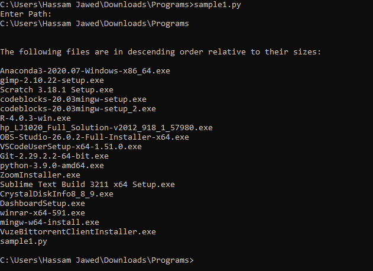
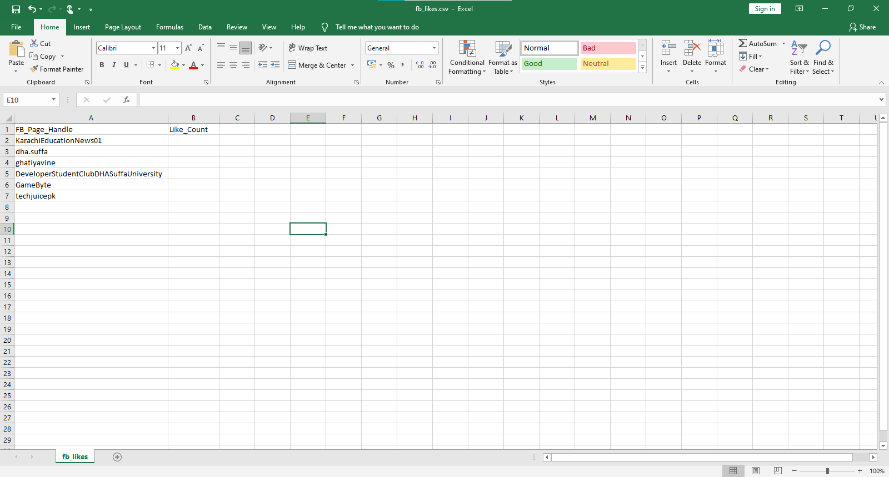
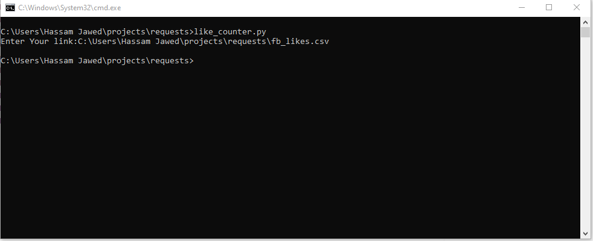
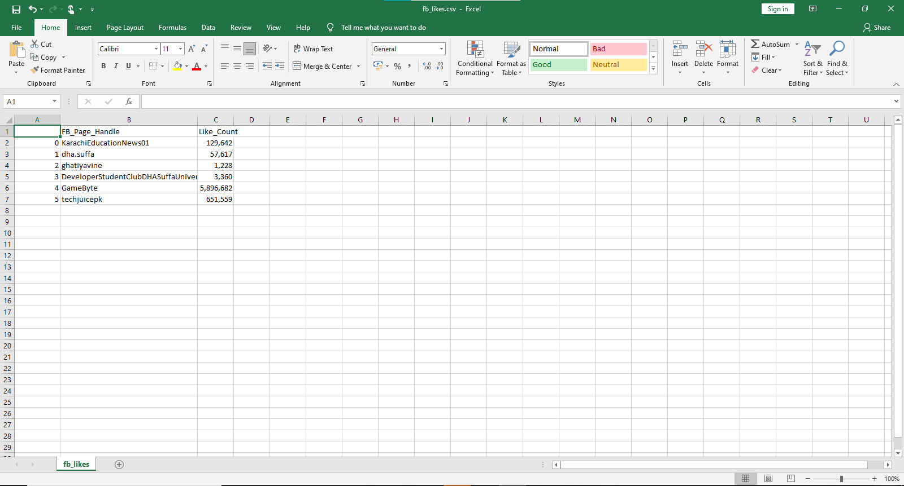

# DSC-DSU | Python Bootcamp 2020 | Week 1
All programs are in folder Assignment Submission.
## 1: 1. Take as user input a folder path and print all the files in descending order of their respective sizes
The size.py takes the path and then prints the files in the path in descending order with respect to their sizes.

## 2: Program to take 5 students records and then prints the name of highest & lowest scorer
The like_counter.py takes the files as csv,in the csv their are facebook pages name,then it scraps the likes on the facebook pages then print it back to the csv file.

